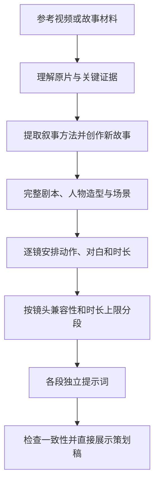

# qisi-video-remix

**给 Agent 一个参考视频，得到新故事、完整剧本、分镜表和可复制的分段视频提示词。**

作者：**qisi** · [MIT License](LICENSE) · [完整输出示例](examples/creative-plan.md)

一个面向 AI Agent 的视频策划 skill。给它参考视频，它会借鉴原片的叙事方法，创作新故事，并直接展示 **剧本 → 人物与场景 → 分镜 → 生成分段 → 可复制提示词**。

默认做创意改编。无需选择模式，无需阅读 JSON，也无需接入特定 APP 后端。

## 最终输出

| 内容 | 用途 |
| --- | --- |
| 本次方案 | 确认片名、总时长、画面比例、风格和单段时长上限 |
| 参考分析与改编思路 | 看清原片的叙事方法，以及新故事改动了什么 |
| 完整剧本 | 阅读各场次的行动、对白、转折和结尾 |
| 人物、造型与场景 | 确定外貌、服装、空间关系和关键道具 |
| 角色与场景生图提示词 | 每个人物的身份图、每套出镜造型图、每个场景图，分别提供可复制提示词 |
| 分镜表 | 检查每镜时长、画面、运镜、说话人和声音 |
| 视频分段表 | 查看覆盖镜头、实际时长、切分原因和段间衔接 |
| 逐段生成提示词 | 将每段完整描述复制到所选视频生成工具 |
| 制作备注 | 了解时长与镜头检查结果，以及仍需确认的事项 |

结果直接在对话中呈现；有文件写入能力时，同时保存为 `creative-plan.md`。每段提示词展开所需人物外貌、造型、场景、动作和对白，可以独立复制使用。

## 看看交付效果

[完整示例：便利店里的一场误会](examples/creative-plan.md) 包含 30 秒剧本、6 个镜头、2 个 15 秒生成段和各段完整提示词。示例的参考材料为虚构文字梗概，用来展示交付结构，不代表完成过真实视频分析或生成测试。

## 安装

Codex 用户可以直接克隆到技能目录。以下命令适用于尚未安装的情况：

```bash
git clone https://github.com/wyuzhi/qisi-video-remix.git "${CODEX_HOME:-$HOME/.codex}/skills/qisi-video-remix"
```

下载并解压本仓库，将整个 `qisi-video-remix` 文件夹放入 Agent 支持的技能目录。确保 `SKILL.md` 直接位于该文件夹下；GitHub 下载的文件夹若带有 `-main` 后缀，先改为 `qisi-video-remix`。

Codex 使用默认本地技能目录时，安装位置为：

```text
~/.codex/skills/qisi-video-remix/SKILL.md
```

若设置了 `CODEX_HOME`，使用其下的 `skills` 目录。其他支持 `SKILL.md` 的 Agent 按各自的技能安装方式加载完整文件夹，尚未逐一验证各平台兼容性；`agents/openai.yaml` 是可选的 Codex 展示信息。

## 使用

附上视频，然后发送：

```text
使用 $qisi-video-remix 改编这个视频。
面向刚上班的年轻人，做成 30 秒竖屏短片，每段最长 15 秒，轻松一点。
直接给我剧本、角色与场景生图提示词、分镜，以及每段可以复制使用的视频提示词。
```

也可以提供故事梗概、截图和逐字稿。Agent 会说明它实际读到了哪些材料。修改方案时可以直接说：“结尾太煽情，改成一个好笑的误会，相关分镜和分段也一起更新。”

## 工作流程



新意落实到人物选择、事件发展、信息差或解决方式，不能只换姓名和服装。原片可确认事实与新增剧情分开描述；无法确认的声音、身份或转折会标明，不补造证据。

## 视频如何分段

**15／30 秒是单段上限，不是固定段长，也不是单个镜头的长度。** 未提供选择时，Agent 会先询问，不会根据全片总时长代选。

先完成分镜，再从前往后逐镜组织生成段：

1. **检查内容兼容性。** 重大换景、时间跳转、同一人物换造型，或需要不同输入素材时提前切段。普通景别变化和同场景正反打不自动拆段。
2. **检查动作复杂度。** 动作、运镜或多人互动难以在一次生成中连贯完成时，拆成更容易执行的段落；不规定统一的镜头数量上限。
3. **检查时长。** 加入下一镜头会超限，就结束当前段。单镜头本身超限时，先拆成有明确起止状态的镜头。
4. **检查衔接。** 每段写明起始和结束状态，下一段重新描述自己的起点；不会假设已经提供上一段末帧。

例如全片 60 秒、选择 30 秒上限，可以这样拆：

| 生成段 | 内容 | 实际时长 | 切分原因 |
| --- | --- | --- | --- |
| T01 | 家中争执 | 12 秒 | 下一镜转到车站 |
| T02 | 车站告别 | 18 秒 | 下一镜跳到多年后，造型变化 |
| T03 | 多年后发现线索 | 14 秒 | 后续复杂互动独立生成 |
| T04 | 重逢与结尾 | 16 秒 | 故事结束 |

共 **60 秒、4 段**，每段不超过 30 秒。不为凑满拉长动作，也不为减少段数合并不兼容的镜头。实际段长由所属镜头时长相加得到。

## 默认行为

| 项目 | 行为 |
| --- | --- |
| 改编 | 借鉴叙事方法，重新设计事件、人物选择或解决方式 |
| 展示 | 对话中直接展示完整策划；能写文件时额外保存 `creative-plan.md` |
| 比例与时长 | 能确认时参考原片；未知时采用 9:16、约 30 秒 |
| 分段 | 用户选择单段上限 15 秒或 30 秒；先按场景、造型、动作复杂度拆分，再检查时长，不要求填满 |
| 字幕 | 默认不做对白字幕和解释性叠字，可按用户要求修改 |
| 提示词 | 各段展开必要人物、场景、镜头、对白，不依赖隐藏的拼装服务 |

已知模型上限更低时按较低上限规划并说明；固定时长等约束与剧情冲突时再询问调整方式。其他设置可按需求调整。长片按场次组织；响应长度受限时，完整文件保留全部策划，对话展示完整剧本、全片镜头与分段索引及首段提示词，并指明其他提示词的位置。

## 运行条件与边界

这个 skill 是一套指令和参考资料，不包含模型、下载器或视频生成服务。实际读取视频、听取音频及访问链接的能力由宿主 Agent 提供；缺少这些能力时可用文字或截图开始。策划本身无需 API Key 或第三方 Python 依赖。

默认交付到策划，不会自动生成图片、视频或调用付费生成服务。用户进一步要求制作时，由 Agent 使用实际可用工具执行。宿主模型与后续生成工具可能有各自的使用条件和费用。

时长、镜头覆盖和内容一致性由 Agent 检查。未指定生成模型时，分段只是制作规划；提示词是否能生成满意画面需要在所选工具中实际验证。

## 仓库内容

```text
SKILL.md                       Agent 的入口指令
agents/openai.yaml             Codex 展示信息
references/delivery-guide.md   可读交付格式
examples/creative-plan.md      完整展示示例
```


## 许可证

仓库内容使用 [MIT License](LICENSE)。参考视频等外部素材不包含在本仓库许可证授权范围内。

## 反馈与贡献

欢迎通过 [Issues](https://github.com/wyuzhi/qisi-video-remix/issues) 提交问题，或通过 Pull Request 改进规则与示例。反馈时提供所用 Agent、输入类型、单段上限，以及预期和实际输出；附参考材料时请移除私人信息。
